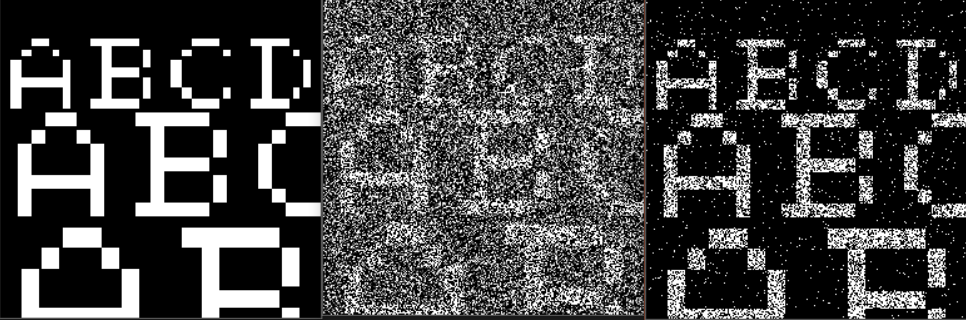

# Image segmentation

We are using Hidden Markov Chain (HMC) for image segmentation : 
The goal is to recover the original image from a noisy one using EM algorithms.

# Example 

Original image | Noisy image | Image from the output of the algorithm   

# Approach

We are using images from the /images folder.
To make them noisy, we add random gaussian pixel to these images.
Then we are using are implementing Markov Chains and the Expectation Maximization Algorithm in order to recover the original image